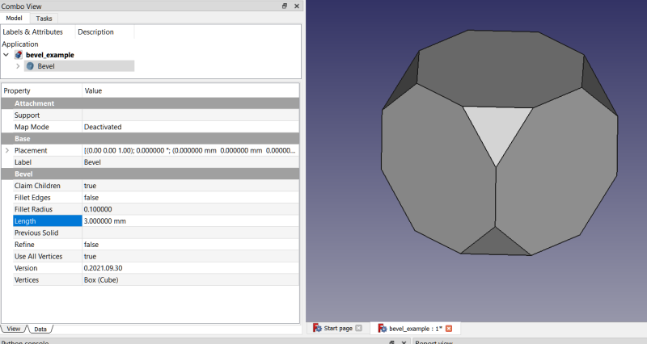
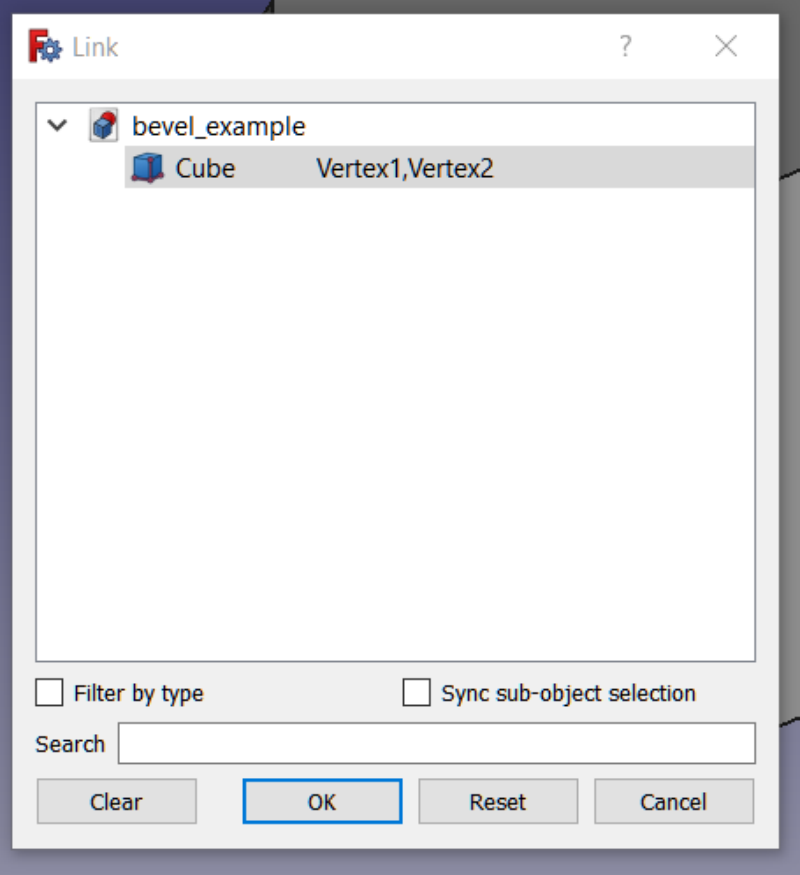
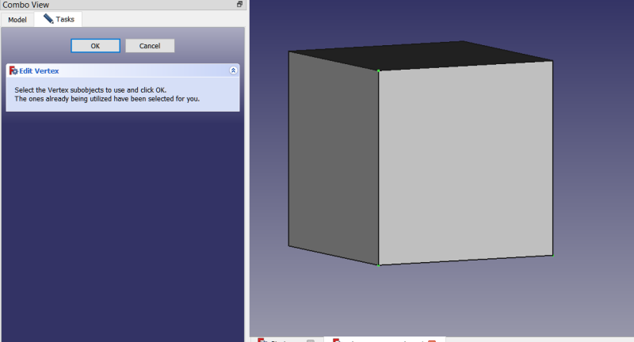

# Bevel

FreeCAD macro that creates a parametric beveled object.  Selected vertices on the selected object are beveled and the edges produced are optionally filleted.  Works with all solids with vertices (but not cylinders or spheres, must be angled corners) including features in Part Design bodies.  In the screenshot below a default Cube created in Part workbench is selected and beveled.

The parametric Bevel object will embed itself within the Part Design body if the object containing the vertices to be beveled is a Part Design feature.  It can be patterned (arrayed) with the Part Design feature patterns, such as polar patterns, linear patterns, mirror patterns, etc.  It behaves very much like other parametric dressup features in FreeCAD, such as fillets and chamfers.

## Toolbar Icon
<a href="Bevel.svg"> Download</a> the icon: 

## Installation
Now available in the addon manager.  Tools menu -> Addon Manager -> Macros tab -> Bevel macro.  On first run it will ask to create another file, bevel.py, which will be placed into the same folder as bevel.FCMacro.  The bevel.py file is not to be run directly, but rather it is imported by bevel.FCMacro, which is the file you need to run to execute the macro.  The reason we need 2 files is so upon saving a Bevel object to a file, and later restarting FreeCAD and opening that file, in order for the Bevel object to maintain its parmetric nature the import file is necessary.  The file creation is a one-time installation and does not need to be created again unless the macro is updated, in which case the bevel.py file is automatically updated and the user is advised to restart FreeCAD to take advantage of the new functionality.  Note: since the addon manager is unaware of and does not track the extra bevel.py file it will not get removed when the macro is uninstalled.  You must manually delete the file if you elect to uninstall.  This can easily be done from within the Macros dialog in FreeCAD.  If you elect not to create the file the macro will still work.  It just won't be parametric if you restart FreeCAD and load a file containing a saved object.  It is recommended to create the file.

## Properties
Bevel objects are parametric, and like just about all parametric objects in FreeCAD there are user-configurable properties available to customize the object.

### Claim Children
This is a boolean property.  If true (default) the object will claim its children in the tree.  You can toggle this value back and forth from true to false to see the effect of this.  It only affects the heirarchy in the tree view and has no affect on the object itself.

## Edit Vertices
Boolean variable used to toggle a command action.  Brings up a simple vertex editor with which you can select the vertices to be used in the 3D view.

## Fillet All Edges
Default: False.  If True, all edges are attempted to be filleted, not just newly created edges.  Note: Refine must be True or fillet will not be attempted because this will sometimes cause FreeCAD to hang.  See also Fillet Edges property.

## Fillet Edges
This is a boolean property, default = false.  If true, the edges created by the bevel are also filleted.  Only the edges created by the bevel operation are filleted.  Use a fillet tool to fillet the others, if desired.  Note: OCCT (Open Cascade Technologies), the CAD kernel FreeCAD uses will sometimes fillet additional edges if they are tangent to a selected edge.  Note2: Refine must be True or else the fillet will not be attempted.  In testing sometimes the filleting operation hangs FreeCAD if Refine is False.

## Fillet Radius
The radius of the fillets, if Fillet Edges property is set to true.  Values are in millimeters.  Default value is 0.1 mm.  Note: fillets are notoriously finicky.  Sometimes they work, sometimes they don't.  Adjusting the fillet radius will often lead to a successful fillet.  It is generally better to start with a small radius and gradually increase to the desired radius.

## Length
This is the distance, in mm, from the vertex to bevel as measured along the edge.  Default is 1 mm.  Note: While chamfers in FreeCAD tend to be rather finicky, like fillets, the algorithm used to create the bevels is quite robust.  Where a chamfer will fail if adjacent chamfers converge, there is no such issue with the bevels created by this macro.

## Refine
Boolean property, default = false.  Setting this to true will attempt to remove any extra, unnecessary edges the object might have.  Note: internally, the feature/object being beveled is refined prior to doing the bevel.  This reduces risk of failure.  The object itself isn't refined, but the shape is copied and refined before the bevel is applied, then that beveled copy is the shape for the Bevel object.

## Use All Vertices
Boolean property, default = false if vertices were selected in the 3D view prior to object creation, else it is true when the whole object is selected from the tree view.  So, if you have many vertices and don't wish to select them all you can just select the entire object to bevel all of the vertices.  Note: this overrides any invdividual vertices selected, so you need to toggle this to false to filter the vertices not listed in the Vertices property.

## Version
This is a string property containing the version of the Bevel macro used to create this object.

## Vertices
This is the base object and, optionally, the individual vertices to be beveled.  Do not delete this object or else it will break the Bevel object.  The vertices are added to a list automatically (based on which vertices were selected), but you can edit this using the property editor if you wish later to add/remove vertices.  It's a little bit tricky to do, but not difficult once you figure out the process.  Double click in the editor dialog in the field just to the right of the object name and begin typing in the vertices you desire.  When finished be sure to select again the object before clicking OK.  Otherwise it can be accidentally deselected.

Alternatively, I have implemented a simple vertex editor with which you can select desired vertices in the 3D view.  Here is a screenshot of it:

## Changelog
** v0.2022.04.06b -- check outsideFusion and insideFusion for null shapes before cutting and fusing
** v0.2022.04.06 -- check for null shapes of both insideFusion and outsideFusion before fusing them together 
** v0.2022.01.19 -- bug fix (typo in source code) 
** v0.2021.12.23 -- bug fix (sort edges prior to making polygon for lofting to point) 
** v0.2021.12.21 -- when base object is 2D face, ensure new faces are all on the same normal 
** v0.2021.12.16 -- don't use edges that are curves 
-- if beveling a 3d object, only make bevels with at least 3 points 
-- if beveling a 2d object, only make bevels with at least 2 points 
--  warn if not at least one bevel was done unless FilletAllEdges = True, because user might only want to fillet all the edges 
** v0.2021.12.14 -- add handling of inside corners (fused instead of cut) 
-- add FilletAllEdges property, to fillet all edges, not just newly created edges 
** v0.2021.10.10.rev3 -- bug fix, only need to worry about previous solid basefeature on deletion when inside PD body, so check for that first 
** v0.2021.10.10.rev2 -- bug fix, uninitialized variable 
** v0.2021.10.10 -- ensure next feature in the tree inherits bevel object's basefeature when bevel object is deleted 
** v0.2021.10.09 -- change icon to more colorized version 
** do not claim children by default in part design  
** add simple vertex editor  
** v0.2021.10.05 -- remove some unnecessary properties already in base class  
** don't ask where to place in tree, but just add to end of the body 
** v0.2021.10.01 -- handle case where user has selected non-vertex subobjects 
** fix bug related to lowercase / uppercase filename 
** v0.2021.09.30 -- initial upload 

